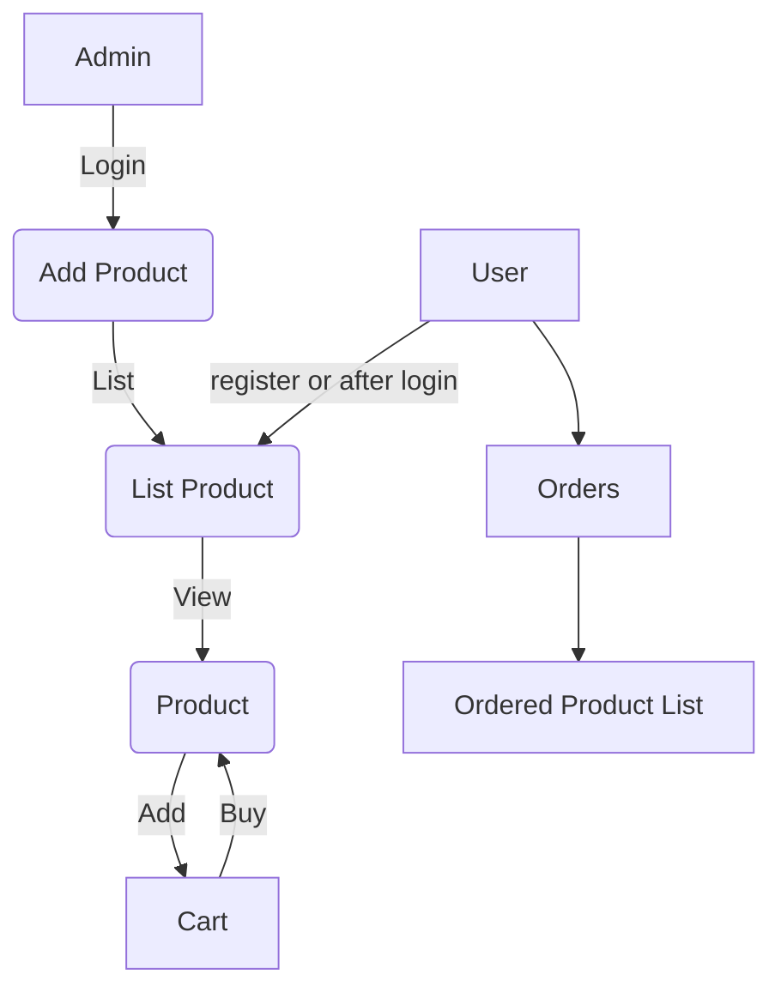

## Steps
- Import postman file from root
- make .env file from env sample
- Install Packages
    ```
    - npm i
    ```
- Start node server
    ```
    - npm start
    ```
## Shop Flow


```mermaid
graph TD
  A[Admin] -->|Login| B(Add Product)
  B --> |List| C(List Product)
  D[User] --> |register or after login| C	
  C --> |View| E(Product)
  E --> |Add| F[Cart]
  F --> |Buy| E
  D --> G[Orders]
  G --> H[Ordered Product List]
```